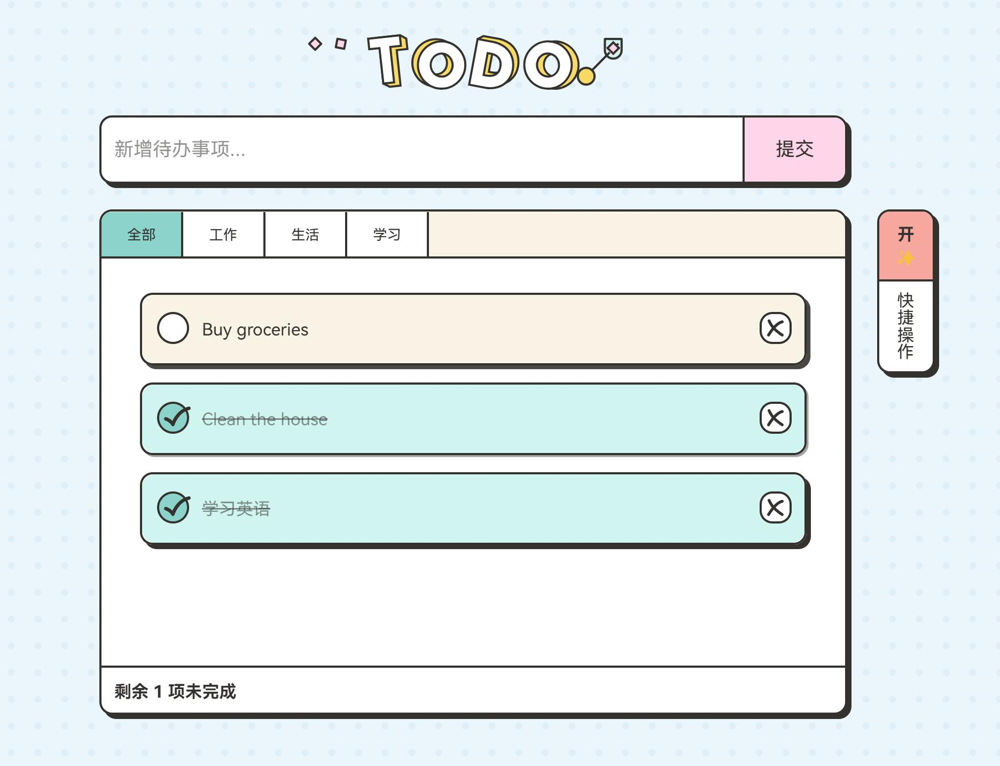

# 🌟 精致待办清单 Todo List 📝

> 一款结合精美动画与现代化设计的待办事项管理工具，支持拖拽排序、状态分类和多语言支持！


## ✨ 特色亮点

- 🎨 **精美界面**：简约现代的UI设计，赏心悦目
- 🔄 **拖拽排序**：直观调整任务优先级（PC端支持）
- 🌓 **多语言支持**：支持中文和英文界面切换
- 💾 **本地存储**：数据安全存储在浏览器本地
- 📋 **分类管理**：工作、生活、学习多种分类
- 🔍 **状态筛选**：全部/进行中/已完成快速切换
- 📤 **导入导出**：支持数据备份与恢复

## 🚀 快速开始

### 1. 克隆仓库

```bash
git clone https://github.com/yourusername/todolist.git
cd todolist
```

### 2. 安装依赖

```bash
npm install
```

### 3. 启动开发服务器

```bash
npm run dev
```

### 4. 构建生产版本

```bash
npm run build
```

## 🛠️ 技术栈

| 技术        | 说明                 |
| ----------- | -------------------- |
| Vue 3       | 前端框架             |
| Vite        | 构建工具             |
| Pinia       | 状态管理             |
| Vue I18n    | 国际化支持           |
| CSS3        | 动态效果与响应式设计 |
| SVG 动画    | 背景图案与加载动画   |
| Web Storage | 本地数据持久化       |

## 📋 功能详解

### 核心功能

- **任务管理**：添加、编辑、删除和完成待办事项
- **拖拽排序**：通过拖拽调整任务顺序
- **状态筛选**：查看全部、进行中或已完成的任务
- **批量操作**：一键标记全部完成、清除已完成或清除全部
- **数据导出**：将任务数据导出保存
- **数据导入**：从文件导入任务数据

### 使用技巧

- 双击待办事项可以编辑内容
- 拖拽待办事项可以调整顺序（仅PC端支持）
- 使用右侧快捷操作面板进行批量操作
- 点击语言切换按钮可以在中英文之间切换

## 🖼️ 界面预览

### 主界面


### 任务编辑


## 📝 开发计划

- [ ] 添加暗色主题支持
- [ ] 实现任务提醒功能
- [ ] 添加标签系统
- [ ] 支持云端同步
- [ ] 开发移动应用版本

## 🤝 贡献指南

欢迎提交问题和功能请求！如果您想为项目做出贡献，请遵循以下步骤：

1. Fork 本仓库
2. 创建您的特性分支 (`git checkout -b feature/amazing-feature`)
3. 提交您的更改 (`git commit -m 'Add some amazing feature'`)
4. 推送到分支 (`git push origin feature/amazing-feature`)
5. 开启一个 Pull Request

## 📄 许可证

本项目基于 MIT 许可证发布 - 详情请参阅 [LICENSE](LICENSE) 文件。

## 👨‍💻 关于作者

楠木 - 热爱创造美好用户体验的前端开发者

## 🙏 致谢

UI设计灵感来自 [ricocc/uiineed-todo-list](https://github.com/ricocc/uiineed-todo-list?ref=opensource-todo)，感谢原作者的优秀设计。

---

⭐️ 如果您喜欢这个项目，请给它一个星标！
```

